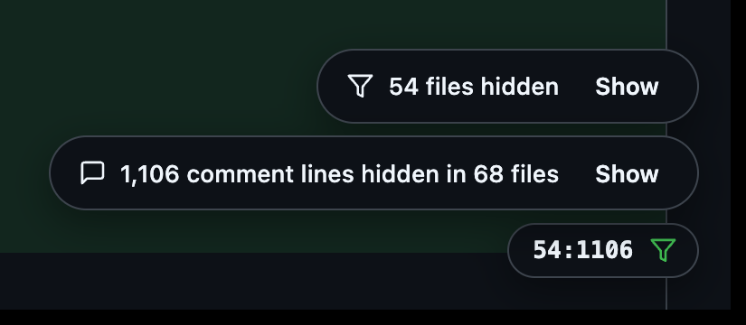
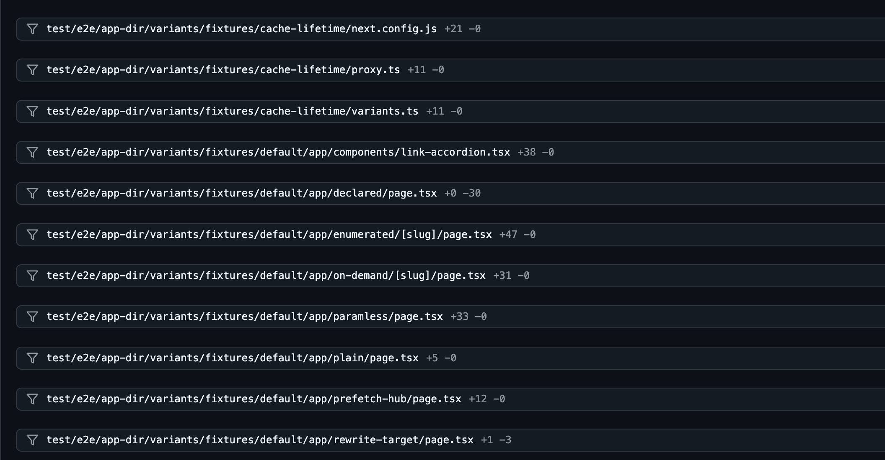

# GitHub diff filters

A Chrome extension that shrinks a GitHub pull request diff to the part you
actually have to read. Two filters, applied automatically on every PR diff
screen:

- **Hide files** — test files, snapshots, lockfiles, generated and vendored
  code, seeded data, renames with no changes, mode-only changes, binaries, and
  files you have marked Viewed each collapse to a one-line stub showing the path
  and diffstat. The file tree hides them too, and a directory disappears once
  every file under it is hidden, so a `test/` subtree collapses whole. Each
  category is switchable on its own, per repository.
- **Hide comment diffs** — hides diff lines whose only change is a comment or
  whitespace, in languages whose comment syntax is known. A line in a language
  it cannot name is left alone rather than guessed at.

The PR header gains a second figure beside GitHub's own, typed the same way. It
is what is left to read once both filters are done: GitHub's totals less the
hidden files and less the comment-only lines inside the files still on screen.


A file carrying **review feedback is never collapsed**, and `onlyChanged` mode
collapses whatever is identical to your previous visit, which is what a
re-review after a fix round actually needs.

## The control



One control sits in the bottom-right corner: `54:1106` — files hidden, then
comment-only lines hidden — beside a funnel that is lit while the filters are
in force. Hover or focus it and it expands into the two pills above.

- **Show** on a pill is a peek: it reveals that filter's hidden content for
  this pull request in this tab and leaves the repository's setting alone.
- The **funnel** opens the settings: switch the filter off for this repository,
  or turn any category off — say, keep lockfiles visible here. Those choices
  are stored per repository and follow your Chrome profile between machines.
  The extension's options page has the same controls.
- Clicking the shorthand pins the pills open, for anyone without a hover.



Click a stub to open just that file.

## Install

Load it unpacked:

1. Open `chrome://extensions/`
2. Turn on **Developer mode**
3. **Load unpacked** → choose this repository's `extension/` folder

`npm run package` builds two zips in `dist/`: one wrapping a folder for sharing
with someone who will Load unpacked, and one with `manifest.json` at the root
for a Chrome Web Store submission. See [CHROME_WEB_STORE.md](CHROME_WEB_STORE.md)
to publish it.

Managed Chrome profiles often block unpacked extensions. `install.html` offers
the same two filters as bookmarklets — drag either button to the bookmarks bar
and click it on a diff.

## Keyboard

| Key | Action |
| --- | --- |
| `t` | Hide or show the filtered files |
| `c` | Hide or show comment-only lines |
| `j` / `k` | Next and previous file still on screen |

Modifiers, text fields and anything that is not a diff screen are left alone,
and the shortcuts switch themselves off when GitHub's accessibility setting
disables single-character keys. `__ghDiffFilterControls.setKey(action, key)`
rebinds one.

## How it decides what to hide

By **path**, never by content, so a file collapses before its diff has finished
loading — which is what makes it usable on a 500-file PR.

Test files: `test`/`tests`/`spec`/`specs`/`__tests__`/`__mocks__`/`testdata`/
`e2e`/`cypress`/`playwright` directories; `.spec.` `.test.` `.cy.` filenames
with `.`, `-` or `_` separators; Python `test_*.py`, `*_test.py`,
`conftest.py`; Go `_test.go`; Ruby `_spec.rb`; JVM `*Test.java`, `*Spec.kt`,
`*IT.java`; .NET `*Tests.cs`; PHP `*Test.php`; `.feature`; and test-runner
configs. Snapshots: `.snap` and `__snapshots__/`. Lockfiles: the npm, yarn,
pnpm, bun, Cargo, Bundler, Poetry, Composer, Pipenv and Go module locks.
Generated: `*.pb.*`, `*_pb2.py`, `*.g.*`, `*.generated.*`, `generated/`,
`*.min.js`, `*.min.css`, `*.designer.cs`. Vendored: `vendor/`, `third_party/`,
`node_modules/`, `Pods/`. Seeded data: `seeds/`, `goldens/`, `baselines/`,
`captured/`, `fixtures/`.

Three more come from the file header rather than the path, since the path says
nothing about them: a rename with no changes, a mode-only change, and a binary
GitHub will not render. Files you tick **Viewed** hide too, and come back when
you untick them.

Deliberately not matched: `test-utils/`, `latest.ts`, `manifest.js`,
`request.ts`, `webpack.config.js` — near-misses a looser rule would eat. The
full table of both is in `test/rules.test.js`.

For a repo that keeps tests somewhere unusual, add a pattern from the console;
it persists:

```js
__ghTestFileFilter.addRule('/legacy-checks/')
```

## Console API

`window.__ghTestFileFilter`:

| Member | Purpose |
| --- | --- |
| `enabled` | Get/set the repository's stored preference |
| `hiding` | Whether files are hidden right now, preference and peek together |
| `peek(on)` | Show the hidden files for this pull request without changing the preference |
| `summary()` | The pill's numbers: hidden, matched, files on screen, and the preferences in force |
| `categories` / `setCategory(name, on)` | Which kinds of noise hide: test, snapshot, lockfile, generated, vendored, data, rename, mode, binary, viewed |
| `settingsOpen` / `toggleSettings(on)` | The category popover the funnel opens |
| `debug()` | Table of every file with its path, matched rule, state and diffstat |
| `report()` | Compact dump of what the path and count probes saw, for a bug report |
| `rules` / `addRule(pattern)` / `clearCustomRules()` | The active rule list and the persisted extras |
| `show(needle)` | Reveal every hidden file whose path contains `needle` |
| `apply()` / `reset()` | Re-run or undo the pass |
| `defaultEnabled` | The setting for repositories with no preference of their own |
| `repo` / `clearRepoPreference()` | The current scope, and handing it back to the default |
| `onlyChanged` | Collapse files identical to your previous visit to this PR |

Preferences resolve per repository with a global fallback, so switching a
category back on for one repo leaves the rest alone. Nothing here needs the
console: the funnel on the corner control opens the same controls, and the
extension has an options page.

`window.__ghCommentFilter` carries `enabled` / `hiding` / `peek()` /
`summary()` / `apply()` / `reset()` / `debug(needle)` for comment-only lines,
and `window.__ghDiffFilterControls` exposes `keys`, `setKey(action, key)`,
`enabled` and `help()` for the keyboard shortcuts.

If the pill warns `N unread`, it matched N file containers but could not read
their paths — GitHub's markup moved, and `debug()` says which files.

## Why the header sometimes says "lines" instead of "+X -Y"

GitHub's classic file headers carry only a combined changed-lines number per
file, not a signed split; the signed totals exist only for the PR as a whole.
Counting rendered `+`/`-` rows looks like a way to recover the split, but a file
GitHub left collapsed renders few or no rows, so those counts silently
under-report. A row count is trusted only when it foots to that file's own
changed-lines total, and otherwise changed lines are reported. A wrong number is
worse than a coarser one.

## Two GitHub diff UIs

`/pull/N/files` exposes a path on `data-path`. The `/pull/N/changes` review
view does not: its file tree names each file in a row whose id is the path, and
the one key a tree row shares with its diff pane is the anchor
`diff-<sha256 of the path>`, so the tree is read first and joined to the panes
on that anchor. The review view also re-renders every container after load and
again as you work, discarding anything written on an element, so hiding is done
through a stylesheet keyed on those anchors rather than on the elements, and a
pass runs within a second even while GitHub keeps mutating. Its changed lines
are `code.diff-text.addition|deletion` with the sign in a marker span; the
comment filter reads that shape and the classic one.

## How the scripts fit together

`bootstrap.js` starts the two filters once a diff is on screen; `bridge.js`
relays preferences to `chrome.storage.sync` from the isolated world;
`controls.js` renders the corner control and owns the shortcuts. Everything the
extension draws carries the class `ghdf-ui`, and each filter's observer ignores
mutations that touch only such nodes — a pass must never schedule the next one.
Each filter exposes `summary()` and fires a `ghdf:state` event when its pill
changes; the control is rendered from those.

## Development

```bash
npm install
npm test            # every suite, against the readable source AND the minified build
npm run build       # minify, encode the bookmarklet URLs, regenerate install.html + extension
npm run check:build # fail if a built artifact drifted from its source (CI runs this)
npm run icons       # rasterise icon.svg to the PNG sizes the manifest declares
npm run package     # build, then zip for sharing and for the Web Store
```

Edit `hide-test-files.src.js` and `hide-comment-diffs.src.js`. Everything under
`extension/filters/`, the `.min.js` and `.bookmarklet.txt` files and
`install.html` are build output.

The extension ships the **readable** source of both filters rather than the
minified builds: the Chrome Web Store rejects obfuscated code, and reviewers
read what ships. Minification exists only to fit the bookmarklets into URLs.

Tests run in jsdom against markup modelled on both GitHub diff views, including
a suite that replays the review view's re-renders and mutation storms. The
behaviour above was checked against a live public pull request,
`vercel/next.js#98217`: 86 files, 54 hidden and 32 kept, 89 tree rows hidden,
1,106 comment-only lines hidden across 68 files, and the header reading
`+3,022 -227 · after filter +616 -67`.

## License

MIT — see [LICENSE](LICENSE).
